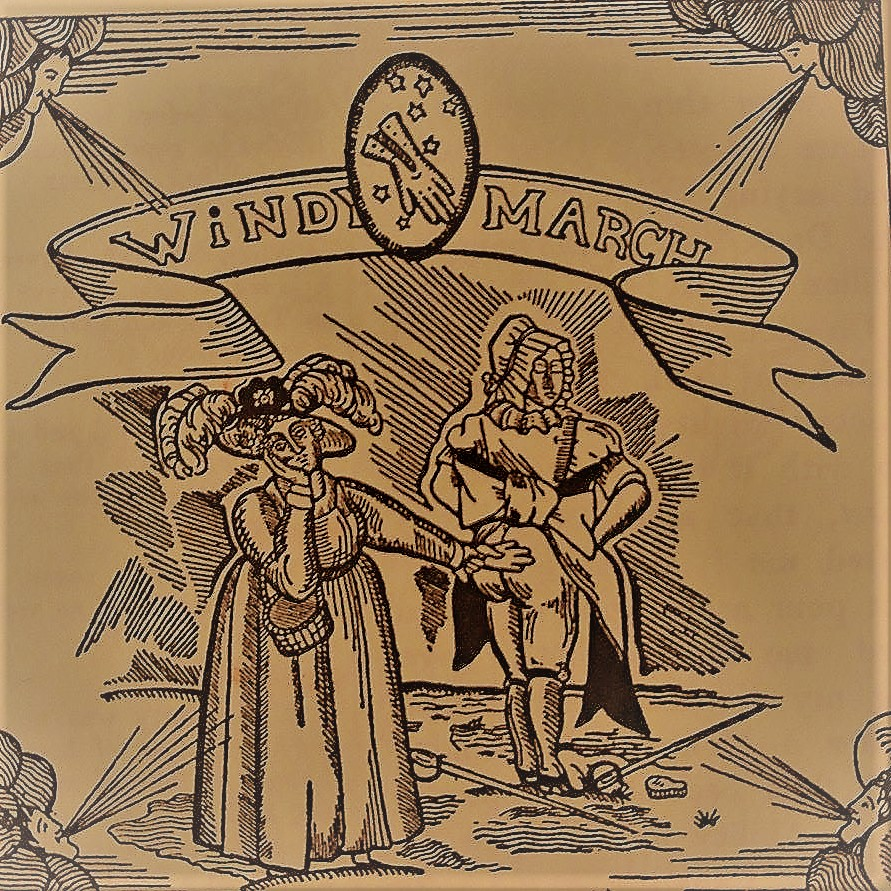

# “For when a Girl falls in Love, with no matter what, should she not be protected in some way, from Hazzard, ever attending that which is illegal?” (March 19)

At first glance, this quote seems to be referring to the idea that lesbians should be given rights in order to protect themselves from persecution.  It is important to understand, that the speaker of this quote is not specifically stated.  However, we are given the fact that Lady Buck-and-Balk, and Tilly-Tweed-In-Blood enter to the “Temple of the Good Dame Musset” and thus spoke these words.  This temple could represent a place of worship, such as the ancient temples in Greece and Rome that were dedicated to the the Gods and Goddesses of that time. It was a place of worship towards these divine beings. To these ladies, Dame Musset might resemble a very important person, a venerable being that reserves the right to be worshipped by them.  The Temple would be the house that Dame Musset is living in which is supported by the Greek translation of the word Temple which is a dwelling.  Now the next question is, why would these ladies go to Dame Musset to appeal this question?  It could possibly be because they viewed her as a saint, or a savior as such. If Dame Musset is being represented as a powerful being, the ladies may have set out on this journey to appeal to her for guidance, and for assistance.

Assistance of what?  Assistance of their question, to form it into a cause and a movement.  When they say a “Girl falls in Love”, it could represent the true bond between them; Love being their relationship, or further meaning marriage between them.  Love implicates the action of gaining an emotional connection with your beloved, and the “no matter what” adds on to the strength of this bond.  Usually this phrase is used in the context of disregard with whatever happens; whatever happens-happens.  This implicates that the lovers would stay together even in the toughest of times; which could refer to the negative views of homosexualism this time.  However, the point being made here seems to refer to protection for these women, especially from “Hazzard”.  The modern definition comes the word Hazard, a slight alteration in the spelling that is used to explain a danger or risk.  Through this understanding, it seems that Lady Buck-and-Balk, and Tilly-Tweed-In-Blood show their displeasure that there was little tolerance during this time and it was considered an illegal action.  However, Hazzard may be referring to a person or another object.  In fact, the other definition of Hazard is that it is a “game at dice in which the chances are complicated by a number of arbitrary rules.” Using this definition, the speaker may in fact be alluding to the fact that lesbians were playing a dangerous game.  Not only that, but there relationship was being affected by a bunch of unnecessary rules which further complicates their “chances” which may refer to their relationship.  In effect, this quote seems to be a call to Dame Musset, a request that they have presented to her in order to get something done.  They believe that Dame Musset is all knowing and powerful, and thus attend her “Temple” in order to pray (in a sense) and communicate with her, which loops back to their belief that she was a saint. 

[Home](https://gwilly.github.io/Ladies-Almanack)
