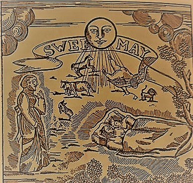

# “I yearn with any very great Vastness for the early eighties; then Girls were as mute as a Sampler…” (May 35)

This quote is spoken by Dame Musset to Nip, after being enquired to recall her situation back in the days especially during her experiences with lesbians growing up.  Analyzation of this quote must first begin with the tone that Dame Musset is trying to convey.  She apparently “yearns with any very great Vastness for the early eighties” explaining her want to traverse backwards in time and experience or remember the time back then.  Yearning is an intense variation of want, so to say that she yearns for the early eighties, shows that she has a great longing for that time. In addition to this, her feelings are further intensified by her use of any, very, and great.  This structure may have been common during this time, however it could also be seen as a greater magnitude of yearning that she feels.  Any may be included to show that every inch of her body or “I”, is uncontrollably want to go back during this time.  The words very and great further adds to this nostalgic feeling that she must be experiencing.  Another important aspect of this quote is the “Vastness” that she yearns for.  The literal translation for vastness is a very great extent or size. So to add it all together the words any, very, great, and Vastness only serve to multiply her yearning for the early eighties. 
  
Yet why does she yearn for the early eighties?  Which eighties is she referring to?  From the external sources we have obtained, the eighties most likely refer to the 1880s.  This makes sense due to the fact that Barnes was born in 1892, and could be alluding to the fact that she misses her early childhood. Then Dame Musset further adds that the “Girls were mute as a Sampler”.  Mute could be taken as someone who cannot talk to others or in a more abstract analyzation, a person that may be unexpressed, or a person whose opinions may be unheard.  Furthermore, a sampler may not also mean someone who takes samples, but it’s French derivative is essamplaire or also known as exemplar. An exemplar is someone who is a perfect model, a paragon. So in essence, Dame Musset explains how these “Girls” were unspoken, and displays of the utmost high quality human beings.  Placed within the context of May, Dame Musset further explains that “Upon my Sword there is no Rust” which could be a metaphor for saying that she has been interacting with different types of women.  Rust usually accumulates on swords that have been unused, thereby lacking the proper maintenance to be used in battle. This is clearly what Dame Musset gets at, as in the same chapter, she explains the many different types of women that she has had experience with. This quote may be contextualized to the real world as well. If Dame Musset is a representation of the contemporary lesbian; the muteness of these girls may be displayed to not mock, but draw upon the situations of ladies in general during this time period. Without a voice, they cannot express their concerns - they are powerless.  

[Home](https://gwilly.github.io/Ladies-Almanack)
